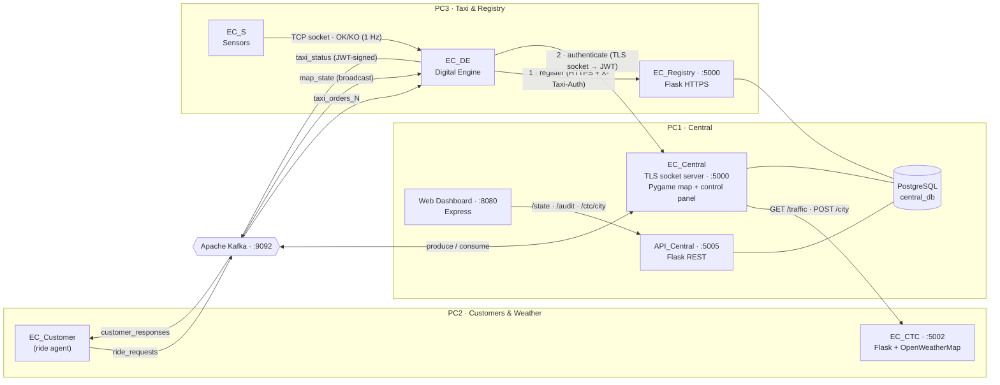

# 🚕 EasyCab — Distributed Ride‑Hailing Platform

> A fault‑tolerant, event‑driven ride‑hailing simulator built on **Apache Kafka**, with **TLS‑secured** taxi onboarding, **JWT‑signed** messaging, real‑time map visualization, and full **audit logging**.


---

## Overview

**EasyCab** is a distributed simulation of a ride‑hailing service (think Uber/Cabify) in which autonomous taxis pick up and transport customers across a 20×20 toroidal city grid, coordinated by a central control system.

The platform is composed of independent processes — designed to run across multiple machines — that communicate **asynchronously through Apache Kafka** for the operational data plane, and over **secure sockets / HTTPS** for authentication and onboarding. A central orchestrator assigns taxis to customers, streams live map state to every node, reacts to real‑world weather conditions pulled from an external API, and records every security‑relevant event in a tamper‑evident audit log exposed through a web dashboard.

This repository is **Practice 2 (P2)** of the system: it layers **security (TLS/SSL, JWT, a certificate‑issuing Registry) and auditing** on top of the socket‑based foundation built in Practice 1, while consolidating inter‑service communication on Kafka.

**Core capabilities**

- 🛰️ **Event‑driven architecture** — Kafka topics decouple customers, taxis, and the central system.
- 🔐 **Secure onboarding** — two‑step taxi authentication (HTTPS Registry → TLS socket) with short‑lived JWT session tokens.
- ♻️ **Fault tolerance** — taxis can drop and reconnect within a grace window with full service‑state restoration.
- 🌦️ **External weather integration** — sub‑zero temperatures recall every taxi to base automatically.
- 🧾 **Audit & observability** — every auth/security/traffic event is persisted and searchable from a web console.

---

## Architecture

EasyCab follows a **hub‑and‑spoke, microservice** topology. The **Central** system is the brain; every other component is a satellite that talks to it through Kafka (data plane) or secure sockets/HTTPS (control & auth plane). The reference deployment splits the components across three machines (`PC1`, `PC2`, `PC3`).

### Components

| Component | Repo path | Role |
|-----------|-----------|------|
| **EC_Central** | `PC1/Central/EC_Central.py` | Central orchestrator. TLS auth socket server, taxi/customer matching, JWT issuing, fault‑tolerance logic, live Pygame map + operator control panel. |
| **API_Central** | `PC1/Central/API_Central.py` | Flask REST API (`:5005`) exposing system state, audit logs, and city‑change requests to the web front‑end. |
| **Web Dashboard** | `PC1/Front/` | Node/Express app (`:8080`) serving a live map view and an audit explorer. |
| **EC_Customer** | `PC2/Customer/EC_Customer.py` | Customer agent. Emits ride requests and consumes responses via Kafka; driven by JSON itineraries. |
| **EC_CTC** | `PC2/EC_CTC/EC_CTC.py` | City Traffic Control. Flask service (`:5002`) that queries **OpenWeatherMap** and maps weather → traffic status. |
| **EC_Registry** | `PC3/EC_Registry/EC_Registry.py` | Certificate registry. Flask **HTTPS** service that registers/de‑registers taxis and issues `cert_token`s. |
| **EC_DE** (Digital Engine) | `PC3/Taxi/EC_DE.py` | The taxi's "brain". Authenticates with Central, drives movement on the grid, hosts a socket server for its sensors, renders its own map view. |
| **EC_S** (Sensors) | `PC3/Taxi/EC_S.py` | Taxi sensor agent. Streams `OK`/`KO` status to its Digital Engine over a TCP socket (simulates obstacles/incidents). |
| **DatabaseManager** | `PC1/Central/map_reader.py` | Shared PostgreSQL data‑access layer (taxis, clients, locations, tokens, CTC status, audit log). |

### Component & message‑flow diagram



### Kafka topics

| Topic | Producer → Consumer | Payload |
|-------|---------------------|---------|
| `ride_requests` | EC_Customer → EC_Central | `ride_request`, `customer_finished` |
| `customer_responses` | EC_Central → EC_Customer | `ride_confirmation`, `ride_completed`, `ride_rejected`, `service_interrupted`, `service_resumed`, `service_terminated` |
| `taxi_status` | EC_DE → EC_Central | Position/state updates, sensor events, `disconnect` — **every message carries the taxi's JWT** |
| `taxi_orders_<id>` | EC_Central → EC_DE | Per‑taxi commands: `pickup`, `stop`, `resume`, `go_to`, `return_to_base`, `resume_service`, `reauth_required` |
| `map_state` | EC_Central → EC_DE | Broadcast snapshot of the 20×20 grid for taxi‑side visualization |

> `taxi_status` and `taxi_orders_<id>` are provisioned by `PC2/Kafka/create_topics.py`; the remaining topics are auto‑created on first use.

### Network ports

| Service | Port | Protocol |
|---------|------|----------|
| EC_Central — taxi auth socket | `5000` | **TLS** / TCP |
| EC_Registry | `5000` | **HTTPS** (Flask) |
| EC_CTC | `5002` | HTTP (Flask) |
| API_Central | `5005` | HTTP (Flask) |
| Web Dashboard | `8080` | HTTP (Express) |
| EC_DE — sensor socket | configurable | TCP |
| Apache Kafka | `9092` | Kafka |
| PostgreSQL | `5432` | PostgreSQL |

> EC_Central and EC_Registry share the default port `5000` because they are intended to run on **separate hosts** (`PC1` and `PC3`).

---

## Tech stack

- **Languages:** Python 3.10+, JavaScript (Node.js)
- **Messaging:** Apache Kafka (`kafka-python`)
- **APIs & web:** Flask + `flask-cors` (services), Express (dashboard)
- **Database:** PostgreSQL (`psycopg2`)
- **Security:** TLS/SSL (`ssl`), `PyJWT` (HS256), self‑signed X.509 certificates, `secrets`‑based registration tokens
- **Visualization:** Pygame (Central map & per‑taxi grid views)
- **External API:** OpenWeatherMap (current weather)

---

## Key features

### Distributed, event‑driven core
- Fully decoupled processes communicating through Kafka pub/sub — customers, taxis, and Central never call each other directly.
- **Per‑taxi command topics** (`taxi_orders_<id>`) plus a **broadcast `map_state`** topic that keeps every taxi's view consistent with the Central map.
- Atomic taxi assignment under concurrency using PostgreSQL `SELECT … FOR UPDATE SKIP LOCKED`.

### Fault tolerance & resilience
- **Graceful taxi reconnection:** when a taxi drops mid‑service, Central holds its state for a **10‑second window**; on reconnect it issues a `resume_service` order that restores the in‑flight trip (pickup vs. drop‑off phase, client, destination).
- **Incident handling:** if the window expires, the taxi is marked unavailable, sent back to base in the DB, and its customer is notified (`service_terminated`) and re‑queued for another taxi.
- **Token lifecycle:** session tokens are invalidated when a taxi returns to base `[1,1]`, forcing re‑authentication (`reauth_required`).

### Security & auditing (P2)
- **Two‑step onboarding:** a taxi first registers with **EC_Registry over HTTPS** (guarded by an `X‑Taxi‑Auth` header) and receives a `cert_token`; it then authenticates with **EC_Central over a TLS socket** and receives a **JWT session token** (HS256, 1‑hour expiry).
- **Signed messaging:** Central verifies the JWT on **every** `taxi_status` message before acting on it.
- **End‑to‑end audit trail:** auth successes/failures, missing‑header attempts, weather/traffic changes, and errors are written to an `audit_log` table (source, source IP, action, details, timestamp) and surfaced through a paginated, filterable **audit dashboard**.

### External weather/traffic integration
- **EC_CTC** queries **OpenWeatherMap** for the current city and derives a traffic verdict: temperature **below 0 °C ⇒ `KO`**, otherwise `OK`.
- Central polls CTC every 10 s; on an `OK → KO` transition it **recalls all taxis to base**. The operating city can be changed at runtime from the dashboard.

### Operator tooling
- Real‑time **Pygame** map of taxis, customers, and locations, plus a control panel to **Stop / Resume / Return‑to‑base / Go‑to** any taxi.
- Web dashboard mirroring live system state (taxis, clients, locations, weather) for remote monitoring.

---

## Getting started

### Prerequisites
- **Python 3.10+**
- **Apache Kafka** with a broker reachable at `localhost:9092` (Zookeeper or KRaft)
- **PostgreSQL** with a `central_db` database
- **Node.js 18+** (for the web dashboard)
- An **OpenWeatherMap API key**

### 1. Install dependencies

```bash
# Python services
pip install kafka-python psycopg2-binary pyjwt flask flask-cors requests pygame

# Web dashboard
cd PC1/Front && npm install && cd -
```

### 2. Initialize PostgreSQL

Create the `central_db` database and the schema. The taxi table DDL ships in `shared/Utils/createTableTaxis.txt`; the application also expects `locations`, `clients`, `taxi_tokens`, `audit_log`, `ctc_status`, and `ctc_commands` tables.

```bash
psql -U postgres -d central_db -f shared/Utils/createTableTaxis.txt
```

Seed the `locations` table with the pickup/drop‑off points used by the customers (`A–F`, defined in `PC2/Customer/EC_locations.json`).

### 3. Provision Kafka topics

```bash
python PC2/Kafka/create_topics.py        # creates taxi_status and taxi_orders_<i>
```

### 4. Configure the weather API

Set your OpenWeatherMap API key in `PC2/EC_CTC/EC_CTC.py` (`API_KEY`).

### 5. Launch the services (in order)

```bash
# City Traffic Control (weather)  ·  PC2
python PC2/EC_CTC/EC_CTC.py

# Certificate Registry (HTTPS)     ·  PC3
python PC3/EC_Registry/EC_Registry.py

# Central orchestrator             ·  PC1   (args: listen_port  kafka_broker)
cd PC1/Central && python EC_Central.py 5000 localhost:9092

# Central REST API                 ·  PC1
python PC1/Central/API_Central.py

# Web dashboard → http://localhost:8080
cd PC1/Front && npm start
```

### 6. Add taxis and customers

```bash
# Digital Engine (taxi)   args: central_ip  central_port  kafka_broker  sensor_port  taxi_id
cd PC3/Taxi && python EC_DE.py localhost 5000 localhost:9092 8001 1

# Sensors for that taxi   args: de_ip  de_port
python EC_S.py localhost 8001          # press ENTER to toggle OK/KO, 'q' to quit

# Customer                args: broker_address  client_id (single letter)
cd PC2/Customer && python EC_Customer.py localhost:9092 a
```

> Each taxi needs a unique `taxi_id`, a unique `sensor_port`, and a matching sensor process. Customer itineraries live in `PC2/Customer/EC_Requests_<id>.json`.

---

## Project context

EasyCab was developed for the **Distributed Systems** course at the **University of Alicante**. It is a multi‑practice project:

- **P1** established the core architecture — Central, Digital Engine, Sensors, and Customer — over raw sockets and Kafka.
- **P2** (this repository) hardens the platform with **transport security (TLS/SSL), a certificate‑issuing Registry, JWT‑authenticated messaging, fault‑tolerant reconnection, and a full audit subsystem** with a web console.

The result is a compact but realistic study of the concerns that define production distributed systems: asynchronous messaging, service decoupling, concurrency control, authentication, partial‑failure recovery, external API integration, and observability.

> *Academic project — credentials, certificates, and API keys included in the repository are for local development only and must not be reused in production.*
